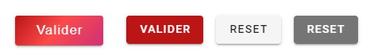
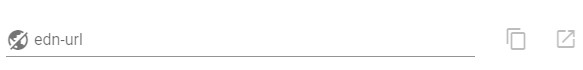
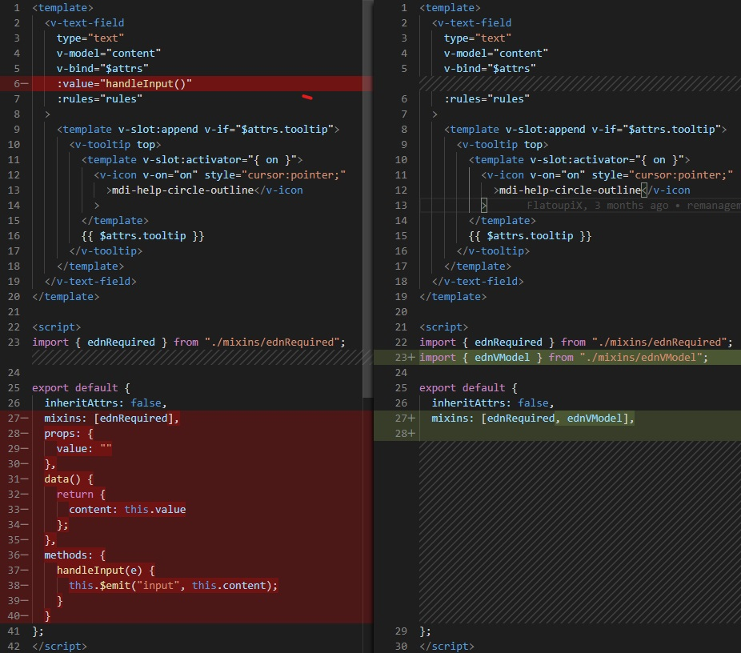

 <!-- <link rel="stylesheet" href="./style/style.css" /> -->

# EUDO-FRONT


## Installation du composant

```node
npm config set registry=http://eudopublish.eudonet.com:51200/npm/Eudonet-npm/

npm install eudo-front
```

## Initialisation du composant

```js
//main.js
import Vue from "vue";
import App from "./App.vue";
import Vuetify from "vuetify";
import fr from "vuetify/es5/locale/fr";
import eudoFront from "eudo-front";
import "vuetify/dist/vuetify.min.css";

Vue.use(eudoFront);

const opts = {
  icons: {
    iconfont: "mdi",
  },
  theme: {
    options: {
      customProperties: true,
    },
    themes: {
      light: {
        primary: "#bb1515",
        secondary: "#757575",
        accent: "#82B1FF",
        error: "#FF5252",
        info: "#2196F3",
        success: "#4CAF50",
        warning: "#FFC107",
      },
    },
  },
  lang: {
    locales: { fr },
    current: "fr",
  },
};
Vue.use(Vuetify);

new Vue({
  vuetify: new Vuetify(opts),
  render: (h) => h(App),
}).$mount("#app");
```

N'éspérez pas utiliser eudo-front sur un projet from scratch.

## LISTE DES COMPOSANTS

- Éléments de mise en page
  - Espace libre
  - Ligne libre
  - Ligne blanche
  - Etiquette
  - Séparateur
- Les caractères
  - `Champs - <edn-field>`
  - `Catalogue <edn-cat>`
  - `Choix multiple <edn-cat-x>`
  - `Mémo <edn-memo>`
- Les numériques
  - `Numériques <edn-num>`
- Les temporels
  - `Date <edn-date>`
  - `Heure <edn-time>`
- Les cliquables
  - `Radio <edn-radio>`
  - `Checkboxes <edn-check>`
  - `Switches <edn-switch>`
  - `Bouton <edn-btn>`
  - `Color-picker <edn-color>`
- Les coordonnées
  - `Téléphone <edn-phone>`
  - `E-Mail <edn-mail>`
  - Réseau social
  - Géolocalisation
- Les visuels
  - Image
  - Graphique
  - Page Web
  - Lien Web
  - Fichier
  - Loader
- Les utilisateurs
  - Utilisateurs
  - Groupe

---

## Champs `<edn-field/>`

|    Paramètre     |       Type       |
| :--------------: | :--------------: |
|   **tooltip:**   |     `String`     |
| **placeholder:** |     `String`     |
|    **label:**    |     `String`     |
|  **required:**   | `Bool || String` |

#### Exemple :

```html
<edn-field label="Prénom" :required="true" /> // Ce cas enclenchera la valeur
par défaut.

<edn-field label="Prénom" :required="Le prénom n'est pas rempli" /> // Celui-ci
```

---

## Catalogue `<edn-cat/>`

|    Paramètre     |       Type       |
| :--------------: | :--------------: |
|   **tooltip:**   |     `String`     |
| **placeholder:** |     `String`     |
|    **label:**    |     `String`     |
|  **required:**   | `Bool ou String` |
|    **items:**    |     `Array`      |

#### Exemple

```html
Liste simple
<edn-cat label="Ville" :items="cities" />

Liste d'objets
<edn-cat label="Ville" :items="oCities" item-value="id" item-text="text" />
```

```js
var cities: ["Lyon", "Toulon", "Paris", "Marseille"];

var oCities: [
  {
    id: 1,
    city: "Lyon",
  },
  {
    id: 2,
    city: "Toulon",
  },
  {
    id: 3,
    city: "Paris",
  },
  {
    id: 4,
    city: "Marseille",
  }
];
```

---

## Catalogue multiple `<edn-cat-x/>`

|    Paramètre     |       Type       |
| :--------------: | :--------------: |
|   **tooltip:**   |     `String`     |
| **placeholder:** |     `String`     |
|    **label:**    |     `String`     |
|  **required:**   | `Bool ou String` |
|    **items:**    |     `Array`      |

#### Exemple

```html
<edn-cat-x label="Passions" :items="passions" />
```

---

## Mémo `<edn-memo/>`

|    Paramètre     |       Type       |           |            |
| :--------------: | :--------------: | :-------: | :--------: |
| **placeholder:** |     `String`     |           |            |
|  **required:**   | `Bool ou String` |
|    **html:**     |      `Bool`      |           |            |
|    **label:**    |     `String`     |           |            |
|  **disabled:**   |      `Bool`      |           |            |
|    **size:**     |     `String`     |           |            |
|     **-->**      |    `'normal'`    | `'large'` | `'fatass'` |

#### Exemple

```html
<edn-memo label="Description" />
```

---

## Bouton `<edn-btn/>`

|    Paramètre    |       Type       |            |
| :-------------: | :--------------: | :--------: |
|   **color:**    |     `String`     |            |
| **validation:** | `String ou Bool` | `skin2019` |

#### Exemple

```html
<edn-btn class="mx-2" validation="skin2019" @click="Validate()">Valider</edn-btn>
<edn-btn class="mx-2" validation @click="Validate()">Valider</edn-btn>
<edn-btn class="mx-2" @click="Reset()">Reset</edn-btn>
<edn-btn class="mx-2" color="secondary" @click="Reset()">Reset</edn-btn
```

<center>

## 

</center>

---

## Numérique `<edn-num/>`

|    Paramètre     |       Type       | Documentation |
| :--------------: | :--------------: | :-----------: |
|   **tooltip:**   |     `String`     |               |
| **placeholder:** |     `String`     |               |
|    **label:**    |     `String`     |               |
|  **required:**   | `Bool ou String` |               |
|    **mask:**     |     `String`     | Voir exemple  |

#### Exemple

```html
<edn-num :label="Revenu" mask="### ### ###,##" />
```

---

## Date `<edn-date/>`

|    Paramètre     |       Type       |                     Documentation                     |
| :--------------: | :--------------: | :---------------------------------------------------: |
|   **tooltip:**   |     `String`     |                                                       |
| **placeholder:** |     `String`     |                                                       |
|    **label:**    |     `String`     |                                                       |
|  **tripStyle:**  |    `Attribut`    |
|  **required:**   | `Bool ou String` |
|   **format:**    |     `String`     | [date-fns](https://date-fns.org/docs/Getting-Started) |

#### Exemple

```html
<edn-date label="Choississez votre date de rendez-vous" format="DD-MM-YYYY" />
```

---

## Heure `<edn-time/>`

|   Paramètre    |       Type       |
| :------------: | :--------------: |
|  **tooltip:**  |     `String`     |
|   **label:**   |     `String`     |
| **required:**  | `Bool ou String` |
| **tripStyle:** |    `Attribut`    |
|   **slots:**   |     `Array`      |

#### Exemple

```html
<edn-time label="Choississez votre heure de rendez-vous" />

<edn-time
  label="Choississez votre plage horaire"
  :slots="['20:20','20:40','21:00','21:20','21:40']"
/>
```

---

## Heure `<edn-load/>`

|  Paramètre   |    Type    |            |
| :----------: | :--------: | ---------- |
| **message:** |  `String`  |            |
|  **form:**   |  `String`  |            |
|   **-->**    | `'simple'` | `'double'` |
|  **anim:**   |  `String`  |            |
|   **-->**    |  `'dots'`  | `'blink'`  |

#### Exemple

```html
<edn-load message="Chargement en cours" form="double" />
```

---

## Heure `<edn-radio/>`

|  Paramètre  |   Type   |     |
| :---------: | :------: | --- |
| **label:**  | `String` |     |
| **radios:** | `Array`  |     |

#### Exemple

```html
<edn-radio message="Chargement en cours" :radios="radios" />
```

---

## Téléphone `<edn-phone/>`

|    Paramètre     |   Type   |              |
| :--------------: | :------: | :----------: |
|   **tooltip:**   | `String` |              |
| **placeholder:** | `String` |              |
|    **label:**    | `String` |              |
|  **required:**   |  `Bool`  |              |
|    **mask:**     | `String` | Voir exemple |

#### Exemple

```html
<edn-phone :label="Votre numéro de téléphone" mask="+## (#) # ## ## ###" />
```

---

## Heure `<edn-url/>`

|      Paramètre       |   Type   |                                  |
| :------------------: | :------: | -------------------------------- |
|      **label:**      | `String` |                                  |
|    **readonly:**     |  `Bool`  |                                  |
|    **disabled:**     |  `Bool`  |                                  |
| **pasteContentRes:** | `String` | Message de confirmation de copie |
|   **wrongUrlMsg:**   | `String` | Message d'url erronée            |
|    **regexUrl:**     | `String` | Regex personnalisable            |
|     **@onError**     |  `Bool`  | Etat des erreurs du champ        |

#### Exemple

```html
<edn-url label="edn-url"></edn-url>
```

<center>

## 

## </center>

## Heure `<edn-list-mod/>`

|     Paramètre      |   Type   |                                              |
| :----------------: | :------: | -------------------------------------------- |
|     **label:**     | `String` |                                              |
|    **headers:**    | `Array`  | Définition des en-tête du mode liste         |
|     **items:**     | `Array`  | Tabeau d'élements à passer dans le composant |
|  **nbItemToAdd:**  | `Number` | Nombre d'élements ajoutés au scroll          |
| **listMaxLength:** | `Number` | Taille d'une page                            |
|    **height:**     | `Number` | Taille du mode liste, `default:500`          |

#### Exemple

```html
<edn-url label="edn-url"></edn-url>
```

<center>

## 

## </center>

## E-mail `<edn-mail/>`

|      Paramètre      |       Type       |                                                                                                                      |
| :-----------------: | :--------------: | -------------------------------------------------------------------------------------------------------------------- |
|     **label:**      |     `String`     |                                                                                                                      |
|    **required:**    | `Bool ou String` | Si une string est renseignée elle s'affichera en tant que message lorsqu'une erreur de type champs requis apparaîtra |
| **invalidMailMsg:** |     `String`     | Le texte entré sera affiché lors de l'affichage d'une erreur de type... erreur de typage                             |
|    **readonly:**    |      `Bool`      |                                                                                                                      |
|    **disabled:**    |      `Bool`      |                                                                                                                      |

#### Exemple

```html
<edn-mail label="edn-mail"></edn-mail>
```

# Changelog

#### @0.1.22

### `<edn-memo/>`

- Hérite de l'attribut id et ename

### `<edn-num/>`

- Ajout du support du mask (covid oblige)
- Hérite de l'attribut id et ename

### `<edn-date/>`

- Ajout d'une icone representative
- Hérite de l'attribut id et ename

### `<edn-time/>`

- Ajout d'une icone representative
- Hérite de l'attribut id et ename

### `<edn-list-mod/>`

- Ajout du composant mode-liste avec défilement infini
- Câblage avec l'api eudo

### `<edn-phone/>`

- Ajout de la possibilité d'ajouter son propre mask

### `<edn-mail/>`

- Ajout de la documentation de `<edn-mail>`
- Ajout d'une props de modification du message d'erreur de typage

### `Dark Theme`

- Ajout du theme dark ! ~~J'en avais un peu marre de m'éclater les yeux en bossant la nuit~~

#### @0.1.21b

### `<edn-url/>`

- Ajout d'un event `@onError` qui donne fait le retour de l'état des erreurs sur le champ url

#### @0.1.21

### `<edn-url/>`

- ajout de la possibilité de modifier la regex déjà en place
- ajout d'une props pour le message d'url erronnée.
- ajout du filigrane http://
- VM de la version 0.1.21 disponible ici : https://codesandbox.io/s/vmeudo-front-0121-g9e86

#### @0.1.20

- Correction de la documentation de `edn-cat`
- Ajout de `edn-url`

  

  Voir documentation pour plus d'informations

- Uniformisation de `edn-btn`, il hérite désormais de l'api Vuetify, quelques modifications ont été apportées à ses propriétés. Voir documentation.
- Correction d'absence du composant `date-fns` Merci `@Jbzel` pour l'aide.
- Publication d'une version compilée utilisable au travers des balises `<script/>` pour le dev. Merci encore `@Jbzel`
- VM de la version 0.1.20 disponible ici : https://codesandbox.io/s/vmeudo-front-0120-pin4u

#### @0.1.19

- à la demande de `@Mcorr` ajout d'un mode plage horaires pour l'utilisation de `edn-time`, ainsi qu'un nouveau rendu pour `edn-date` à été effectué. Voir doc.
- Supression de `moment.js` au profit de `date-fns`, le but étant d'alléger le bundle js final de l'application. Voir [bundlephobia](https://bundlephobia.com/scan-results?packages=moment@2.24.0,date-fns@2.9.0), de plus `date-fns` est conçu pour n'utiliser que les fonctions dont on a besoin.

<center>

|   Package    |    Min     | Min + GZIP |
| :----------: | :--------: | :--------: |
|  **moment**  | 231.7 `kB` | 65.9 `kB`  |
| **date-fns** | 79.3 `kB`  | 16.9 `kB`  |

</center>

- Intégration de ednVModel à `edn-date`
- Optimisation du build de production merci à `@Jbzel`
- Désormais l'edn-btn est en `display:inline-block` cela évite les 100% de largeur des boutons

#### @0.1.18

- Après que `@Aagne` ait remonté un soucis de tranfert de v-model sur certains composants, un nouveau mixin a été créé `ednVModel.js` afin de faire hériter ce comportement à tout les composants.
  
  <center>
  Ci-dessus screenshot du nettoyage des composants grâce à `ednVModel.js`
  </center>
- Désormais chaque version aura une VM utilisable en ligne avec un environnement de développement éditable. [VM eudofront 0.1.17](https://codesandbox.io/s/vmeudo-front-0117-x7yx2)
- Vuetify n'est plus installé sous forme de plug-in, voir initialisation du projet au début de ce document.

#### @0.1.17

- Désormais `edn-memo` hérite de l'api Vuetify (voir doc)

#### @0.1.16

- Mise à jour de toutes les dépendances
- Lors de l'ajout du readonly sur les `edn-time` et `edn-date` les deux synstaxes sont possible à savoir `:readonly="true"` et `readonly`
- Ajout de la prise en compte du `disabled` sur les `edn-time` et `edn-date` les deux synstaxes sont possible à savoir `:readonly="true"` et `readonly`
- Ajout de la prise en compte du `disabled` sur les `edn-color`

#### @0.1.15

- Correction de la syntaxe de `edn-cat` et `edn-cat-x` au niveau de la doc
- ajout de la prise en compte du readonly sur les `edn-time` et `edn-date`

#### @0.1.14

- `<edn-mail>`

#### @0.1.13

- Mise à jour et précisions au niveau de la doc.
- `<edn-mail>`
  - Uniformisation de la mixin `required`, désormais les régles ne seront appliquées que si `required` est renseigné.
- `<edn-cat>`
  - Désormais `required` est bien pris en compte.

#### @0.1.12

- Mise à jour et précisions au niveau de la doc.
- `<edn-*>`
  - Correction des `required` qui ne se vérifiaient jamais.
  - Ajout d'un mixins pour uniformiser le code du required.

#### @0.1.11

- `<edn-*>`
  - correction des `required` qui ne fonctionnaient pas bien. Désormais, il faudra désormais définir le required à true, ou passer une string précisant le message à transmettre. voir doc `<edn-field/>`.

#### @0.1.10

- `<edn-*>`
  - Uniformisation des composant pour qu'ils reprennent bien les valeurs passés en v-model.
- `<edn-field>`
  - Simplification des rules, il suffit juste d'utiliser la prop `required` afin d'enclencher la vérification sur les champs concernés.
- `<edn-date/>`
  - Correction de `<edn-date/>` qui ne remontait pas la date aux parents.
  - Ajout d'un attribut `format` permettant de formatter les dates du picker.
  - Ajout du framework Moment.js
- `<edn-memo/>`
  - Ajout du `disabled` sur l'edn-memo. Pour l'instant le texte du v-model ne sera que de l'html

#### @0.1.9

- Ajout de la possibilité de changer la couleur de l'edn-btn

#### @0.1.8

- Reduction de la taille des boutons de base
- Correction d'un bug au niveau du v-model de l'edn-radio
- Changement de l'emplacement de la couleur sur edn-color

#### @0.1.7

- Ajouts de paramètres supplémentaires sur edn-load

#### @0.1.6

- Correction de la doc

#### @0.1.5

- Désactivation de l'ednPhone

#### @0.1.4

- Correction de dépendances manquantes

#### @0.1.3

- Ajout de edn-load

#### @0.1.2

- bugfixes

#### @0.1.1

- bugfixes

#### @0.1.0

- Passage à Vuetify 2.0
- Ajout de l'edn color picker

#### @0.0.6

- Bugfixes

#### @0.0.5

- Bugfixes

#### @0.0.4

- Bugfixes

#### @0.0.3

- Bugfixes

#### @0.0.2

- Correction de bug d'import de dépendances

#### @0.0.1

- Initialisation du package de référence
